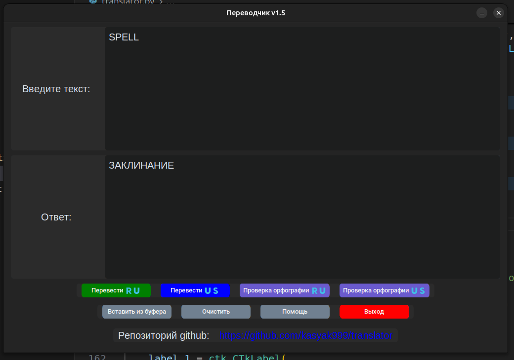

# Translator / Переводчик 

[Ссылка на описание](#описание)

## Установка
1. Скачать исполняемый файл из папки **[dist](/dist/)/translator**
2. Сохринить рядом с файлом **translator** папку словарей, которая находится в **dist/[words](/dist/words/)**
3. Запустить исполняемый файл **translator** 

Конечный результат долже выглядеть так: 
├── translator 
├── words 
│ ├── en.json  
│ └── ru.json

## Для редактирования
Установка зависимостей

`pip install -r requirements.txt`

Создание исполняемого файла

`pyinstaller --onefile translator.py`

### Описание

- Переводчик с любых языков на русский
- Переводчик с любых языков на английский язык
- Проверка орфографии русского языка
- Проверка орфографии английского языка

Текущая версия программы - v1.5
