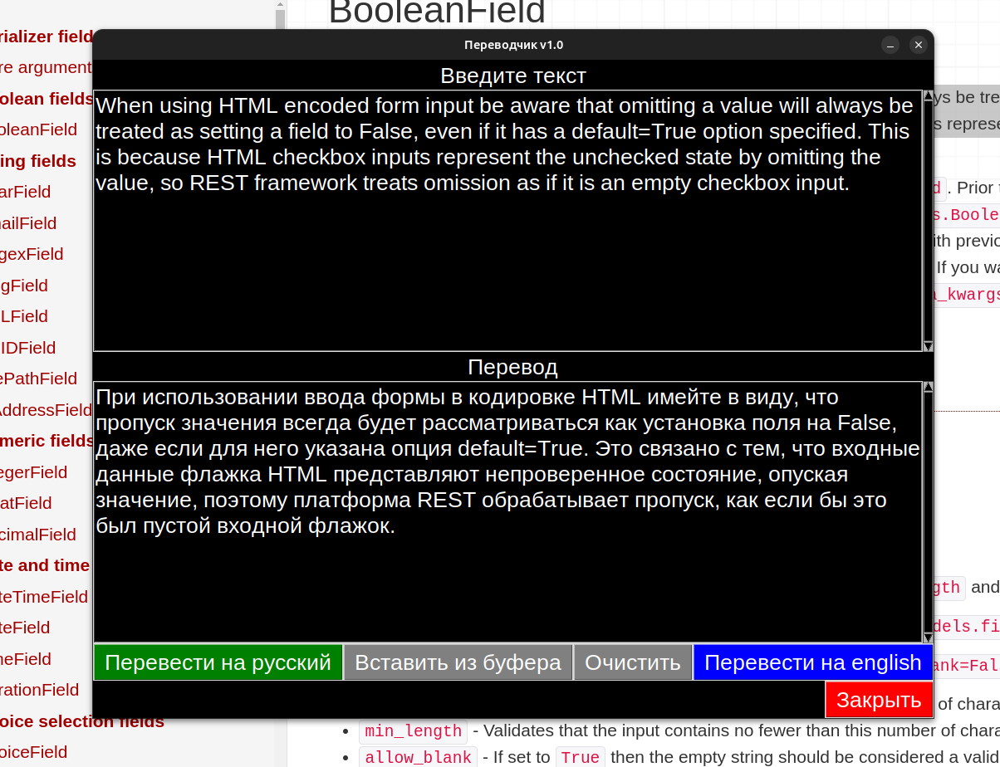

# Мой проект translator

[Ссылка на описание](#описание)

Исполняемы файл лежит в папке dist/

## Для редактирования
Установка зависимостей

`pip install -r requirements.txt`

Создание исполняемого файла

`pyinstaller --onefile translator.py`

### Описание

Программа для перевода текста.

translator.py - основной файл программы

functions.py - функции