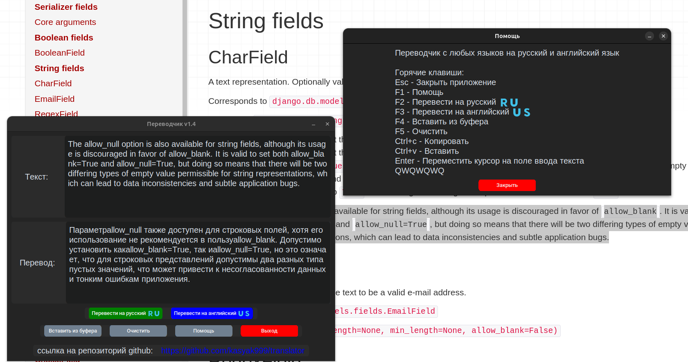

# Translator / Переводчик 1

[Ссылка на описание](#описание)

Исполняемый файл лежит в папке [dist](/dist/)

## Для редактирования
Установка зависимостей

`pip install -r requirements.txt`

Создание исполняемого файла

`pyinstaller --onefile translator.py`

### Описание

Переводчик с любых языков на русский и английский язык.
Текущая версия программы - v1.4.1

translator.py - основной файл программы